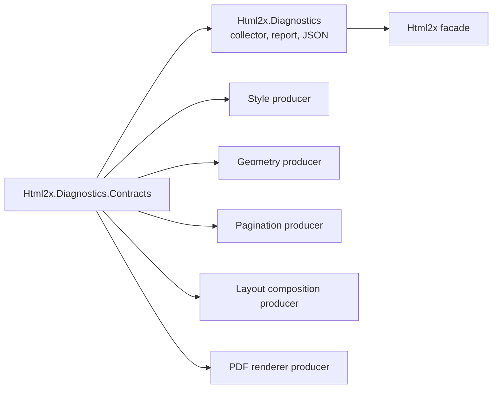

# Diagnostics Architecture

Diagnostics are troubleshooting artifacts. They explain conversion lifecycle,
unsupported input, layout decisions, rendering decisions, and serializer output
without requiring a debugger. This page defines both runtime flow and dependency
boundaries.

## Dependency Direction

Diagnostics producers depend on `Html2x.Diagnostics.Contracts` only. The
diagnostics runtime depends on the same contracts and owns collection and
serialization.



Diagnostic producer modules emit generic records. Producer-local diagnostic
helpers may flatten local domain models into `DiagnosticFields`, but central
diagnostics code must not understand those models.

Diagnostics timing is report-level. `DiagnosticsReport` records conversion
start and end time. Individual `DiagnosticRecord` values do not carry
per-record timestamps.

## Report Flow

After option validation succeeds, `HtmlConverter` creates a `DiagnosticsCollector` when `HtmlConverterOptions.Diagnostics.EnableDiagnostics` is true. The collector is passed as an `IDiagnosticsSink` through style, geometry, layout, pagination, font, and renderer boundaries. The completed `DiagnosticsReport` is exposed on `HtmlToPdfResult.DiagnosticsReport`.

Typical record flow:

```text
LayoutBuild stage/started
  -> dom, style, box-tree, fragment-tree, and pagination lifecycle records
  -> style, geometry, table, pagination, image, or font records
LayoutBuild stage/succeeded with diagnostic snapshot fields
PdfRender stage/started
PdfRender stage/succeeded with render fields
```

If layout fails, `PdfRender` is skipped and the diagnostics report is attached to the thrown exception as `DiagnosticsReport` when available. If cancellation is requested, the active stage emits `stage/canceled` and downstream stages are skipped when they have not started.

If runtime configuration fails after diagnostics collection starts but before
layout starts, such as a missing default font path, the facade emits a
`Configuration` failure and skips both `LayoutBuild` and `PdfRender`. General
option validation happens earlier and throws without diagnostics attachment.

The layout start record includes `htmlLength`. Raw HTML is omitted by default. Consumers can opt in through `DiagnosticsOptions.IncludeRawHtml`; `DiagnosticsOptions.MaxRawHtmlLength` caps the captured value.

Image render diagnostics use a bounded display source in the `src` field and
structural path. Data URI payloads are omitted from that display value, and
rooted or parent-traversal paths are reduced to a path display with the file
name. Raw image source context is omitted by default. When
`DiagnosticsOptions.IncludeRawHtml` is enabled, the renderer may capture the
raw image source in `DiagnosticContext.RawUserInput`, capped by
`DiagnosticsOptions.MaxRawHtmlLength`.

## Ownership

Generic diagnostics contracts that cross project boundaries belong in
`Html2x.Diagnostics.Contracts`. JSON export belongs in `Html2x.Diagnostics`.
Facade options own no diagnostics contracts, collections, report models,
snapshot DTOs, or serializers.

`Html2x.Diagnostics` owns `DiagnosticsCollector`, `DiagnosticsReport`, and
`DiagnosticsReportSerializer`. The report serializer is generic over
`DiagnosticRecord` and `DiagnosticFields`; it must not special-case layout,
geometry, table, renderer, image, or font models.

Pipeline stages own the events that describe their decisions:

- Style owns unsupported element and unsupported or ignored CSS declaration
  diagnostics.
- Layout owns geometry, formatting, table, pagination, image resolution, and unsupported layout mode diagnostics.
- The public facade owns conversion lifecycle and converter-level font path failures.
- The PDF renderer owns renderer summaries and renderer-local failures.
- Shared stage lifecycle event construction belongs in `Html2x.Diagnostics.Contracts`.

## DiagnosticFields Value Rules

`DiagnosticFields` must not accept arbitrary `object`. The allowed value set is
intentionally narrow:

- string
- number
- bool
- enum represented as string
- null
- diagnostic array
- nested diagnostic object

These rules keep JSON serialization generic while preventing domain objects
from leaking into the central diagnostics package.

## Runtime Flow

Producer projects receive `IDiagnosticsSink?` through method parameters and
reference `Html2x.Diagnostics.Contracts` only. The public facade creates
`DiagnosticsCollector` when diagnostics are enabled and exposes the resulting
`DiagnosticsReport` on `HtmlToPdfResult`.

Renderer diagnostics flow through the contracts project boundary, the same as
style, geometry, layout, pagination, image, and font diagnostics.

The diagnostics runtime must not reference pagination, layout stages, or
producer-local event names such as `layout/pagination/*`. Producer modules own
event names and translate their domain facts into generic diagnostic fields.

## Runtime Ownership

The sink-based runtime path is owned by `Html2x.Diagnostics`:

- `DiagnosticsCollector` implements `IDiagnosticsSink`.
- `DiagnosticsReport` is the immutable read model returned by the collector.
- `DiagnosticsReportSerializer` serializes `DiagnosticsReport`.

The report serializer must remain generic. It may reference
`Html2x.Diagnostics.Contracts` and diagnostics-owned report types. It must not
reference producer-specific models, snapshot DTOs, producer modules,
AngleSharp, or SkiaSharp.

## Facade Boundary

Public facade options do not own diagnostics types. Diagnostics types are split
between `Html2x.Diagnostics.Contracts` and `Html2x.Diagnostics`.

`Html2x.Diagnostics.Contracts` owns `IDiagnosticsSink`, `DiagnosticRecord`,
`DiagnosticSeverity`, `DiagnosticContext`, `DiagnosticFields`,
`DiagnosticObject`, `DiagnosticArray`, `DiagnosticValue`, and
`NullDiagnosticsSink`.

`Html2x.Diagnostics` owns `DiagnosticsCollector`, `DiagnosticsReport`, and
`DiagnosticsReportSerializer`.

## Emission Rule

Production code emits diagnostics through
`IDiagnosticsSink.Emit(DiagnosticRecord)`. Producers do not mutate shared
diagnostics collections directly.

## Severity

- `Info`: expected trace detail or successful decision.
- `Warning`: recoverable issue that can affect visual output.
- `Error`: conversion-blocking or stage-failing issue.

## Context

Emitters should include useful context when available:

- Selector or selector-like source.
- Element identity such as tag, id, class, or role.
- Raw style declaration or value.
- Structural path through DOM, style tree, box tree, fragments, table, or pagination.
- Raw input when diagnostics are explicitly enabled and the value is needed for reproduction.

Large or sensitive producer inputs should use bounded display fields by
default and reserve raw context for explicit opt-in diagnostics.

Missing context should not make the event unreadable.
