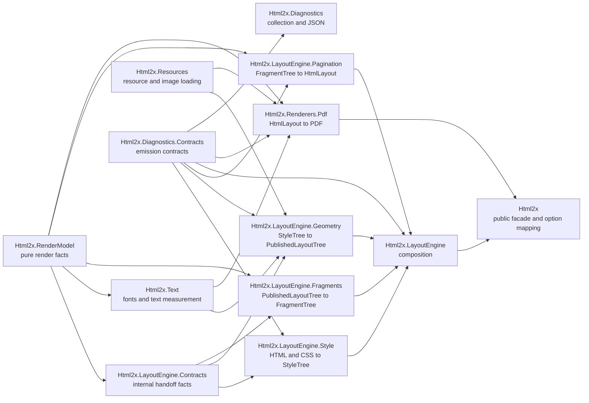

# Module Boundaries

This page defines project ownership and dependency direction for the HTML to
PDF pipeline. Use it when deciding where a new behavior or contract belongs.

## Dependency Direction

The diagram shows allowed consumption direction, not runtime call order.
Producer modules must not reach backward into consumers or implementation
details owned by another stage.

## Ownership Matrix

| Stage | Project | Input | Owned output | Must not own |
| --- | --- | --- | --- | --- |
| Public Facade | `Html2x` | Consumer configuration | `HtmlConverterOptions`, public option groups, public result, and mapping into stage-owned settings | Layout algorithms, renderer algorithms, runtime adapters, documents, fragments, diagnostics runtime internals |
| Render Model | `Html2x.RenderModel` | None | Units, geometry values, style values, font request facts, resolved font facts, documents, pages, and fragments | SkiaSharp, parser packages, filesystem adapters, layout algorithms, pagination algorithms, renderer state |
| Contracts | `Html2x.LayoutEngine.Contracts` | None | Internal pipeline handoff contracts and validation helpers | Parser traversal, CSS computation, mutable boxes, layout algorithms, fragments, pagination pages, renderer state |
| Resources | `Html2x.Resources` | Resource source, base directory, byte limit | Scoped path resolution, data URI parsing, byte checks, loaded image bytes, intrinsic image size, and `ImageLoadStatus` outcomes | Layout geometry, PDF drawing, diagnostics collection, public converter options |
| Text | `Html2x.Text` | Font requests, text measurement requests, diagnostics sink | Font path resolution, text measurement, resolved font diagnostics, and Skia-backed text runtime adapters | Parser traversal, CSS computation, layout engine projects, fragment projection, pagination pages, renderer state |
| Style | `Html2x.LayoutEngine.Style` | Raw HTML, `StyleBuildSettings`, optional diagnostics sink | `StyleTree`, computed styles, supported element traversal, and style diagnostics | Box hierarchy, geometry, fragments, pagination pages, renderer state |
| Layout Geometry | `Html2x.LayoutEngine.Geometry` | `StyleTree`, `LayoutGeometryRequest`, image metadata resolver, text measurer | Internal box geometry, `UsedGeometry`, `PublishedLayoutTree`, layout diagnostics, image and table layout facts | CSS parsing, DOM traversal, parser objects, fragments, pagination pages, renderer state |
| Fragment | `Html2x.LayoutEngine.Fragments` | `PublishedLayoutTree` | `FragmentTree`, fragment IDs, visual style projection, and renderer-facing fragment facts | Mutable boxes, CSS, DOM, text/font adapter seams, pagination pages, renderer state |
| Pagination | `Html2x.LayoutEngine.Pagination` | Render model block fragments and `PaginationOptions` | `PaginationResult`, final `HtmlLayout`, translated fragment clones, page audit facts, placement audit facts | Source fragment mutation, mutable boxes, style facts, geometry engines, fragment projection, parser state, renderer state |
| Paint | `Html2x.Renderers.Pdf` | `HtmlLayout`, `PdfRenderSettings`, diagnostics sink | Paint commands and PDF bytes | Layout pages, fragments, boxes, styles, parser objects, public converter options |

## Public Facade

`Html2x` owns public consumer options. `HtmlConverterOptions` is the single
public conversion request, with page, resources, CSS, fonts, and diagnostics
groups. The facade maps those values into internal settings and requests:
`StyleBuildSettings`, `LayoutBuildSettings`, `LayoutGeometryRequest`,
`PaginationOptions`, and `PdfRenderSettings`.

Runtime stages must not consume public option objects directly. This keeps
public API shape separate from internal stage contracts.

## Render Model Stage

`Html2x.RenderModel` owns pure facts such as `SizePx`, `SizePt`,
`PaperSizes`, `ColorRgba`, `Spacing`, borders, `VisualStyle`, `FontKey`,
`FontWeight`, `FontStyle`, `ResolvedFont`, `HtmlLayout`, `LayoutPage`, and
renderer-facing fragments.

Render model facts can be shared by layout, text, fragment projection,
pagination, renderers, and options without introducing runtime adapter
dependencies.

## Contracts Stage

`Html2x.LayoutEngine.Contracts` owns internal pipeline handoff contracts. It is
not a public consumer API surface.

Important contract namespaces:

- `Html2x.LayoutEngine.Contracts.Style` owns `StyleTree`, `ComputedStyle`,
  source identity, content identity, and style content facts.
- `Html2x.LayoutEngine.Contracts.Geometry` owns `LayoutGeometryRequest`,
  `UsedGeometry`, `PageContentArea`, and geometry source identity facts.
- `Html2x.LayoutEngine.Contracts.Geometry.Images` owns
  `IImageMetadataResolver`, `ImageMetadataResult`, and image metadata outcomes.
- `Html2x.LayoutEngine.Contracts.Published` owns `PublishedLayoutTree` and
  published block, inline, image, rule, table, display, and page facts.

Mutable box types remain geometry implementation state under
`Html2x.LayoutEngine.Geometry.Models`. Current geometry implementation modules
may still live under `Html2x.LayoutEngine.Geometry.Box`. Published layout facts
remain under `Html2x.LayoutEngine.Contracts.Published`.

## Stage Rules

- Style is the only stage that interprets parser and CSSOM state.
- Geometry is the only stage that writes normal-flow layout geometry.
- Fragment projection copies published facts into render model fragments.
- Pagination may translate cloned render model fragments, but must not mutate
  source fragments.
- Rendering draws final page-local render facts only.
- Diagnostics producers emit through `IDiagnosticsSink` and do not depend on
  the diagnostics runtime package.

## Geometry Stage

Geometry consumes contract `StyleTree` only. It may use `ComputedStyle`,
`StyledElementFacts`, and `StyleContentNode` values from
`Html2x.LayoutEngine.Contracts`. It must not reference AngleSharp, `IElement`,
`INode`, DOM child nodes, or CSSOM types.

Geometry publishes `PublishedLayoutTree` instead of exposing mutable box
internals to later stages. For geometry details, see
[Geometry](../internals/geometry.md).

## Fragment Stage

`Html2x.LayoutEngine.Fragments` owns published layout traversal, fragment ID
allocation, style-to-`VisualStyle` conversion, and specialized image, rule, and
table fragment projection. Renderers do not reference fragment projection.

## Pagination Stage

`Html2x.LayoutEngine.Pagination` owns page placement. `LayoutPaginator`
consumes measured render model block fragments and `PaginationOptions`, then
returns `PaginationResult` with the final `HtmlLayout` and audit facts.

## Composition Stage

`LayoutBuilder` calls style first, passes the resulting `StyleTree` to
geometry, projects `PublishedLayoutTree` into fragments, calls pagination, and
returns `PaginationResult.Layout`. If composition needs more data, the owning
stage must publish that data through its handoff contract.

## Extension Rule

If a later stage needs data that only exists in an earlier stage, add that data
to the stage output consumed by the next stage. Do not add backward references.
