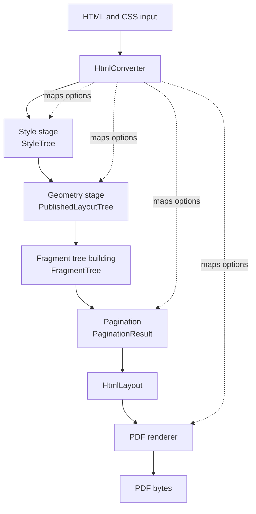

# Processing Pipeline

This page explains how Html2x turns static HTML and CSS into PDF bytes. It
focuses on runtime flow and the facts handed from one stage to the next.

## Pipeline Flow

## Composition

`LayoutPipeline` is the internal composition layer. It coordinates style,
geometry, fragment tree building, pagination, and final layout assembly, but it
does not own HTML parsing, CSS computation, geometry algorithms, fragment
tree building, page placement, or rendering.

The composition flow is stage-first. `LayoutPipeline.BuildAsync` names the
handoff facts between stages: `StyleTree`, `LayoutGeometryRequest`,
`PublishedLayoutTree`, `FragmentTree`, `PaginationOptions`, and
`PaginationResult`. `LayoutStageRunner` wraps geometry, fragment tree building,
and pagination with lifecycle diagnostics so diagnostic plumbing does not
become the structure of the pipeline.

Composition connects these projects:

- `Html2x.LayoutEngine.Contracts` owns `StyleTree`, geometry requests,
  `PublishedLayoutTree`, and shared handoff facts.
- `Html2x.LayoutEngine.Style` owns `StyleTreeBuilder`.
- `Html2x.LayoutEngine.Geometry` owns mutable boxes such as `BlockBox` and
  publishes layout facts.
- `Html2x.LayoutEngine.Fragments` owns `FragmentTreeBuilder`.
- `Html2x.LayoutEngine.Pagination` owns `LayoutPaginator`.
- `Html2x.Resources` owns scoped resource and image loading policy.

AngleSharp and AngleSharp.Css are implementation details of
`Html2x.LayoutEngine.Style`. Geometry and composition code consume contract
facts and must not depend on parser objects.

`Html2x` is the only production mapping boundary from public options into
`StyleBuildSettings`, `LayoutBuildSettings`, `LayoutGeometryRequest`,
`PaginationOptions`, and internal `PdfRenderSettings`. It also selects supported
adapter dependencies from `HtmlConverterDependencies` and creates the
per-conversion image resource store used by layout metadata and rendering.

## Style

`Html2x.LayoutEngine.Style` owns raw HTML parsing, user agent stylesheet
application, CSS parsing, supported element traversal, computed style
construction, and style diagnostics.

Input: raw HTML, `StyleBuildSettings`, and an optional `IDiagnosticsSink`.

Output: contract-owned `StyleTree`.

The `StyleTree` is the parser-free handoff to geometry and is owned by
`Html2x.LayoutEngine.Contracts`:

- `StyleTree.Root` is the body-rooted style tree.
- `StyleNode.Element` is `StyledElementFacts`.
- `StyledElementFacts` carries tag, local name, id, class attribute, and
  case-insensitive attributes required by layout.
- `StyleNode.Identity` is `StyleSourceIdentity`, assigned during parser
  traversal before geometry starts.
- `StyleNode.Content` preserves ordered `StyleContentNode` values for text,
  elements, and line breaks.
- `StyleContentNode.Identity` is `StyleContentIdentity`, assigned for every
  ordered text, element, and line break content item.
- `StyleNode.Children` preserves supported styled element children.
- Unsupported parser elements are flattened by the style module before geometry
  consumes content.

Style owns parser traversal and source identity assignment. Source paths are
diagnostic labels created from style ancestry. Geometry must consume them, not
rebuild them from parser state or CSS selectors.

## Layout Geometry

`Html2x.LayoutEngine.Geometry` consumes contract `StyleTree` input and resolves
layout facts. Layout Geometry may read computed style values, `StyledElementFacts`,
and ordered style content from `Html2x.LayoutEngine.Contracts`. It must not read
DOM nodes, `IElement`, `INode`, child node collections, or AngleSharp types.
Geometry validation helpers stay inside Layout Geometry tests or the Layout
Geometry implementation.

`BoxTreeConstruction` builds the internal mutable box tree from styled nodes.
It creates `BoxRole` values such as block, inline, inline-block, table, row,
cell, image, list item, and rule. The geometry pass then resolves dimensions,
margins, padding, borders, inline layout, image layout, and table placements.

`BlockBoxLayout` coordinates block layout through `BlockLayoutRuleSet`.
Specialized internal modules own normal block-flow sequencing, non-mutating
block-flow measurement, shared block sizing, image block placement, table grid
calculation, table diagnostics and placement, mutable layout writes, published
layout caching, and inline publishing.

Input: `StyleTree` and layout geometry options.

Output: contract-owned `PublishedLayoutTree`.

Published inline text runs include the resolved font facts used during geometry
measurement. Later stages must consume those facts instead of re-resolving font
identity for normal pipeline text.

Source identity flow:

- Geometry consumes `StyleTree` and copies source identity into
  `BoxNode.SourceIdentity`.
- Geometry creates generated source identity for anonymous text boxes, list
  markers, inline-block content boxes, anonymous block wrappers, and other
  generated layout nodes.
- Published layout carries both layout identity and source identity.
  `PublishedBlockIdentity.NodePath` remains the layout path, while
  `PublishedBlockIdentity.SourceIdentity` carries the source identity.
- Published inline sources use the same split: `NodePath` is layout identity
  and `SourceIdentity` is source identity.
- Diagnostics may project source identity through primitive diagnostic fields.
- Renderer-facing documents and fragments remain independent of style
  implementation types and geometry source identity implementation types.

`Html2x.LayoutEngine.Contracts` also owns `LayoutGeometryRequest`, image
metadata contracts, `UsedGeometry`, shared HTML and CSS vocabulary constants
used across style and geometry, source identity records, and published layout
facts. It must not reference parser packages, geometry implementation projects,
fragment implementation code, renderer implementation code, diagnostics
serializers, or mutable box types.

Contract namespace ownership is explicit: style handoff facts use
`Html2x.LayoutEngine.Contracts.Style`, geometry request and value facts use
`Html2x.LayoutEngine.Contracts.Geometry`, image metadata contracts use
`Html2x.LayoutEngine.Contracts.Geometry.Images`, and published layout facts use
`Html2x.LayoutEngine.Contracts.Published`.

## Fragment Tree Building

`Html2x.LayoutEngine.Fragments` owns fragment tree construction from published layout facts
into render model fragments. `FragmentTreeBuilder` consumes `PublishedLayoutTree`,
allocates fragment IDs, and copies style, geometry, and published text run facts
into fragment models.

Input: `PublishedLayoutTree`.

Output: `FragmentTree`, containing blocks, lines, text runs, images, tables,
cells, and rules.

Fragment tree building does not consume mutable boxes, CSS parser state, DOM
objects, text or font adapter seams, pagination pages, or renderer state. It
must not remeasure text, resolve fonts, or reconstruct geometry already owned by
layout.

## Pagination

`Html2x.LayoutEngine.Pagination` owns page placement. Internal `LayoutPaginator`
consumes measured render model block fragments plus `PaginationOptions` and
returns `PaginationResult`. The result contains the final `HtmlLayout` and
stable audit facts for page and placement diagnostics.

Input: unpaginated render model block fragments.

Output: `PaginationResult`.

`HtmlLayout.Pages` is exposed as a read-only list. Pagination assembles pages
through `HtmlLayout.AddPage`, and renderers treat the final page set as input
facts.

Pagination owns translated fragment clones and page assembly. Source fragments
remain read-only inputs. The current internal algorithm is `BlockPaginator`,
which is block-boundary only: it moves whole block fragments between pages and
does not split lines, images, table rows, or paragraphs internally.

## PDF Rendering

Internal `PdfRenderer` consumes `HtmlLayout` and `PdfRenderSettings`, builds
paint commands, and draws to a SkiaSharp PDF document.

Input: `HtmlLayout`.

Output: PDF bytes.

Renderer projects must not reference style implementation details or mutable
geometry internals. Text runs must carry `ResolvedFont` facts before rendering.
If rendering needs more data, add it to the published layout or fragment
contract in the owning stage.

## Failure Model

- Parser and option failures can throw before layout begins.
- Unsupported CSS or structures should emit diagnostics and use the documented
  fallback when possible.
- Contract violations, such as missing required geometry after layout, should
  fail close to the stage that introduced the invalid state.
