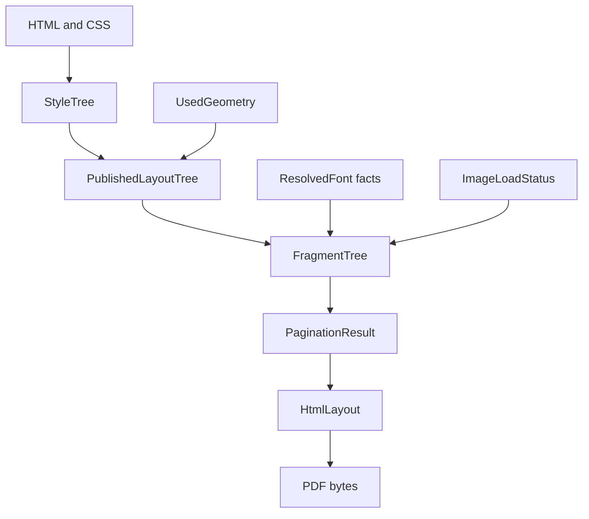

# Core Concepts

This page defines the main facts that move through Html2x. Read it before the
pipeline and internals pages if the project vocabulary is unfamiliar.

## Mental Model

Html2x is a staged converter. Each stage consumes a named input fact and
produces a named output fact for the next stage. Later stages do not reach back
into parser state or mutable layout internals.

## `StyleTree`

`StyleTree` is the parser-free style output. It contains supported styled
elements, ordered content, computed styles, attributes needed by layout, and
style-owned source identity. Geometry consumes this fact instead of traversing
AngleSharp DOM or CSSOM objects.

## `UsedGeometry`

`UsedGeometry` is the canonical block-level geometry value. It carries the
border box, content box, baseline when available, marker offset, and overflow
allowance. Geometry computes it once and publishes it forward.

## `PublishedLayoutTree`

`PublishedLayoutTree` is the immutable layout handoff from geometry to fragment
projection. It contains published block, inline, image, rule, table, source
identity, and final geometry facts. Downstream stages consume this instead of
mutable boxes.

## `FragmentTree`

`FragmentTree` is the renderer-facing tree before page placement. Fragment
projection copies published geometry, visual style, text runs, resolved font
facts, image facts, tables, rules, and display metadata into render model
fragments.

## `PaginationResult`

`PaginationResult` is the pagination output. It contains the final
`HtmlLayout`, page audit facts, placement audit facts, total page count, and
total placement count. Pagination owns page-local translated fragment clones.

## `HtmlLayout`

`HtmlLayout` is the renderer input. It contains read-only `LayoutPage` values
and page-local fragments. The PDF renderer consumes it without inspecting style,
geometry, boxes, parser objects, or fragment projection internals.

## Diagnostics

Diagnostics are structured records emitted by the module that owns a decision.
The records use generic contracts so central diagnostics collection and JSON
serialization do not depend on producer-local models.

## Resources And Text

`Html2x.Resources` owns scoped resource and image loading. `Html2x.Text` owns
font resolution and text measurement. Geometry uses image metadata and text
measurement facts during layout. Rendering uses final image bytes and resolved
font facts already carried by render model input.
