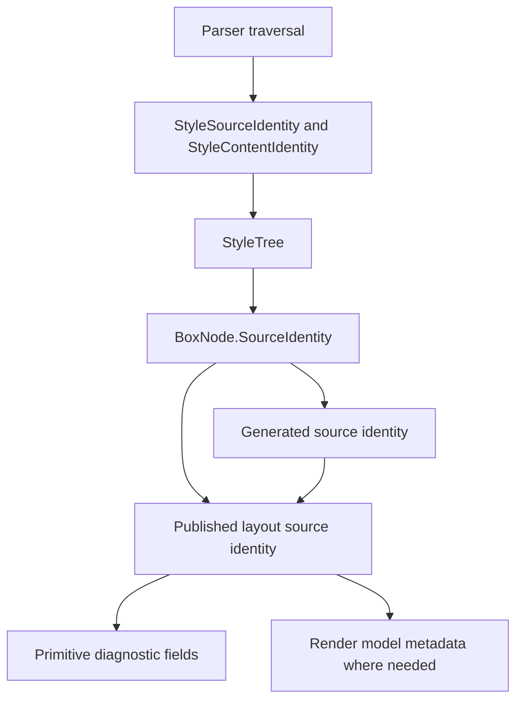

# Source Identity

This page explains how Html2x carries source context through layout and
diagnostics without leaking parser objects across stage boundaries.

## Purpose

Source identity lets diagnostics identify the affected input or generated
layout node. It is not a DOM reference and it is not renderer state.

## Identity Flow

## Style-Owned Identity

The style stage assigns `StyleSourceIdentity` while it still has parser
context. It also assigns `StyleContentIdentity` for ordered text, element, and
line break content. Later stages consume those identities as facts.

## Generated Identity

Geometry creates generated identity for layout nodes that do not directly
correspond to a styled element, such as anonymous text boxes, list markers,
inline-block content boxes, and normalization wrappers.

## Layout Identity

Layout identity and source identity are separate:

- `NodePath` is layout identity owned by geometry.
- `SourceIdentity` is copied or generated from style input.

Diagnostics must keep those concepts separate. A source path explains where a
decision came from. A node path explains where the layout result lives.

## Diagnostics Boundary

Diagnostic records expose source identity only through primitive fields such as
`SourceNodeId`, `SourceContentId`, `SourcePath`, `SourceOrder`,
`SourceElementIdentity`, and `GeneratedSourceKind`. They must not expose
`StyleSourceIdentity`, `StyleContentIdentity`, `GeometrySourceIdentity`, parser
nodes, or mutable boxes directly.
