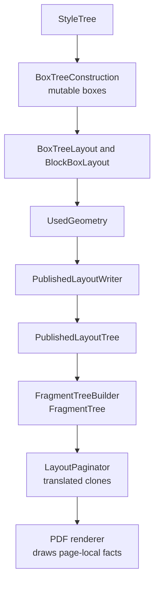

# Geometry

This page explains how `Html2x.LayoutEngine.Geometry` computes layout facts and
publishes them for downstream stages. Geometry is the authority for rectangles,
flow placement, baselines, marker offsets, image placement, table placement,
and published layout facts.

## Geometry Flow

Geometry is computed once during layout, then carried forward without
reinterpretation. Fragments, pagination, diagnostics, and renderers may
translate or copy already-published rectangles, but they must not recompute
padding, border, content rectangles, marker offsets, or block sizes.

## Authority

`UsedGeometry` is the canonical geometry value for block-level layout nodes. It
carries:

- Border box rectangle.
- Content box rectangle.
- Baseline when available.
- Marker offset.
- Overflow allowance.

`UsedGeometryRules` owns geometry construction and normalization at layout
boundaries. It handles finite-value normalization, non-negative sizes, content
rectangle calculation, marker offsets, padding, and borders.

## Helper Ownership

Point-space geometry is owned by `Html2x.RenderModel` through `RectPt`,
`PointPt`, and `SizePt`. Pagination uses `RectPt.Translate` and
`PointPt.Translate` when translating cloned render model rectangles and text
run origins to page-local coordinates.

`UsedGeometry` translation remains geometry-owned in
`Html2x.LayoutEngine.Geometry`. Page content area calculation is a layout-owned
fact in `Html2x.LayoutEngine.Contracts`. `PageContentArea` is shared by
geometry and pagination so page margin normalization has one implementation.

Geometry consumes `Html2x.LayoutEngine.Contracts` facts and produces
`PublishedLayoutTree`. It does not consume parser objects, fragments,
pagination pages, renderers, or PDF state.

## Naming Grammar

Geometry uses these role names consistently:

- `Construction`: creates the internal mutable box tree from style facts.
- `Layout`: places boxes and produces geometry.
- `Measurement`: computes size or extent facts without mutating boxes.
- `Rules`: pure domain decisions and scalar calculations.
- `Writer`: the only module kind that mutates boxes or writes published facts.
- `Request`, `Result`, and `Facts`: data that crosses module seams.

## Block Flow Locality

`BoxTreeConstruction` builds the internal box tree and owns generated boxes,
box tree normalization, text normalization, list markers, and source identity.

`BoxTreeLayout` owns the constructed box root and page-content-area resolution
step. It selects top-level layout candidates and asks block layout to resolve
the selected stack.

`BlockBoxLayout` coordinates individual block layout, block-kind rule dispatch,
default block rule ordering, and publication. Focused internal modules keep the
behavior navigable:

- `BlockFlowLayout` owns laid-out block-flow sequencing.
- `BlockFlowMeasurement` owns state-independent stacked block measurement.
- `InlineFlowMeasurement` owns state-independent inline-flow line measurement.
- `BlockLayoutRuleSet` selects the internal rule for supported block kinds.
- `LayoutBoxStateWriter` owns mutable writes to block, image, table, inline
  layout, and atomic inline box content.
- `PublishedLayoutWriter` owns published block caching, source order, rule
  result publication, inline flow item publication, and inline publishing.

Block flow returns geometry-local flow facts. `PublishedLayoutWriter` is the
only owner that converts those facts into `PublishedBlock`, inline layout, and
published flow item contracts. Block-kind rules must not publish directly.
Measurement modules must not mutate boxes, write published facts, or read
post-layout `UsedGeometry` as a sizing fallback.

## Geometry Owners

The geometry project is organized by behavior owner:

- `Construction`: internal box tree creation and generated source identity
  under `Html2x.LayoutEngine.Geometry.Construction`.
- `BlockFlow`: normal block-flow sequencing, top-level box tree layout, block
  requests/results, block-kind rules, block origin rules, and block sizing
  policy under `Html2x.LayoutEngine.Geometry.BlockFlow`.
- `InlineFlow`: inline-flow layout, buffering rules, inline run construction,
  line layout, and inline placement under
  `Html2x.LayoutEngine.Geometry.InlineFlow`.
- `Measurement`: state-independent content metrics measurement and inline-flow
  measurement facts.
- `Tables`: table structure, grid calculation, table measurement, placement,
  and table-specific diagnostic vocabulary.
- `Images`: image sizing, image layout resolution, and image block layout.
- `Publishing`: published layout facts and published block caching under
  `Html2x.LayoutEngine.Geometry.Publishing`.
- `Diagnostics`: geometry diagnostic names, emitters, and snapshot mapping.
- `Primitives`: geometry validation, translation, and scalar dimension rules
  under `Html2x.LayoutEngine.Geometry.Primitives`.
- `Style`: geometry-local element tag policy under
  `Html2x.LayoutEngine.Geometry.Style`.
- `Writing`: mutable box state writes under
  `Html2x.LayoutEngine.Geometry.Writing`.
- `Models`: mutable internal box models.

`Html2x.LayoutEngine.Geometry.Tables` owns current table behavior. Table
diagnostic vocabulary lives with table behavior, while diagnostic record
emission remains in the focused diagnostics emitter, `TableGridDiagnostics`.

`Html2x.LayoutEngine.Geometry.Images` owns image sizing and image block layout.
Image metadata contracts remain under
`Html2x.LayoutEngine.Contracts.Geometry.Images`; byte loading and path scope
remain under `Html2x.Resources`. `ImageSizingRules` is the concrete geometry
policy; `IImageMetadataResolver` is the internal handoff for image metadata
facts. Geometry consumes source, status, and intrinsic size, but does not carry
base-directory or byte-limit policy through measurement calls.

`InlineFlowMeasurement` owns non-mutating inline-flow measurement. The
`InlineFlow` owner contains the inline-flow layout adapter, inline buffering,
inline run collection, text line layout, baseline rules, justification, and
atomic inline box placement.

## Validation Policy

Layout construction is forgiving where raw calculations enter
`UsedGeometryRules`; invalid intermediate values may be normalized there.
Published geometry is strict. `UsedGeometry` and renderable fragments should
reject non-finite coordinates and negative sizes so invalid geometry fails
close to the producing stage.

## Invariants

- Every laid-out block has `UsedGeometry`.
- Mutable layout geometry is published from `UsedGeometry`.
- Fragment rectangles come from layout geometry.
- Pagination preserves width and height.
- Pagination translation preserves nested baselines, text origins, image
  content rectangles, line occupied rectangles, and block metadata.

## Diagnostics

When diagnostics are enabled, `layout/geometry-snapshot` captures box geometry,
fragment geometry, and pagination placements. Use it to investigate drift
between layout, fragment tree building, and pagination.
